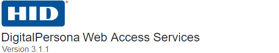

###### [DigitalPersona Access Management API ](https://lenhodgeman.github.io/digitalpersona-access-management-api/)/ Web Access Services / Usage / Overview  

## Usage

DigitalPersona Web Access Management (DP WAM) is a set of web services for different access management tasks,
like user enrollment, identification, authentication, identity claims issuance, access policy management
etc.

* [Details](details.md)
* [Tutorial](tutorial.md)
* [Examples](examples.md)
* [How-to](how-to.md)
* [Reference](reference.md)
